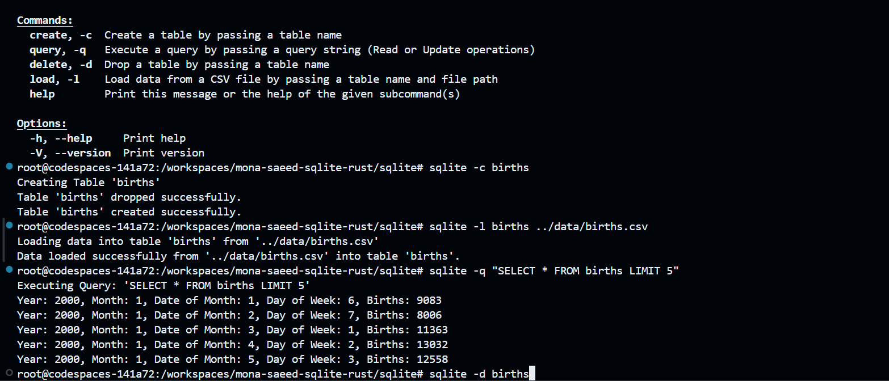

# SQLite Command Line Tool with Rust
[](https://github.com/nogibjj/mona-saeed-individual-2/actions/workflows/CI.yml)

## Overview

The sqlite is a command line utility designed to perform CRUD (Create, Read, Update, Delete) operations on the `births.csv` file included in the data folder. This tool allows users to manage the dataset effectively through various command line commands.

## Features

- **Create**: Create a new table in the `births_database.db` SQLite database based on the `births.csv` schema.
- **query**: Execute custom SQL queries to retrieve data from the database.
- **Delete**: Drop tables or delete records from the database.
- **Load Data**: Load data from the `births.csv` file into the SQLite database.
- **Update**: Update a certain row in the database.

## Prerequisites

- Rust installed on your machine. You can follow the instructions [here](https://www.rust-lang.org/tools/install). Also check this [readme file](https://github.com/johncoogan53/Rust_SQLite/blob/main/README.md)

## Installation

1. Clone the repository:

   ```bash
   git clone https://github.com/nogibjj/mona-saeed-sqlite-rust
   cd mona-saeed-sqlite-rust
   cd sqlite
   ```
run `sqlite -h` to see available options
.png>)

## Example Usage



### Use of GitHub Copilot and Other Language Models

In this project, I utilized GitHub Copilot along with ChatGPT to enhance my coding process. These tools were invaluable in multiple areas:

1. **Code Suggestions**: GitHub Copilot provided helpful autocomplete suggestions for key parts of the project, including SQL database operations, CRUD methods, and error handling in Rust. This saved me time and reduced repetitive coding efforts.
2. **Debugging Assistance**: When I encountered formatting issues and errors (such as during the `make format` step), I consulted ChatGPT to interpret error messages and receive targeted advice on resolving them.
3. **Optimizing Code Structure**: GitHub Copilot and ChatGPT offered recommendations on structuring code for readability and efficiency. This included suggestions on how to modularize functions and best practices for using Rust’s `conn.execute` method.
4. **Markdown and Syntax Support**: For markdown formatting and Rust syntax questions, I used ChatGPT to ensure the README and code met project requirements and adhered to Rust's conventions.